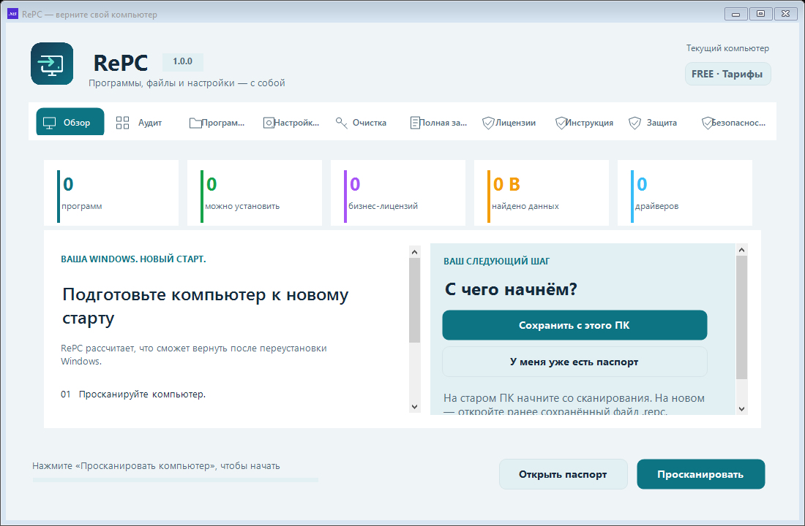

# RePC — сохраните важное перед переустановкой Windows

Файлы, настройки, поддерживаемые игровые сохранения и список программ — в одном локальном паспорте `.repc`. Подготовьте его на старом компьютере и откройте после установки Windows или на новом ПК.

**[Официальный сайт](https://getrepc.ru/?utm_source=github&utm_medium=organic&utm_campaign=free_launch&utm_content=readme)** · **[Скачать предварительный выпуск RC9](https://github.com/flokiss42-source/repc-site/releases/tag/v0.12.0-rc.9)** · **[Инструкция](https://getrepc.ru/guide.html)** · **[Чек-лист перед переустановкой](https://getrepc.ru/windows-reinstall-checklist.html?utm_source=github&utm_medium=organic&utm_campaign=free_launch&utm_content=checklist)**

## Как это работает

1. На старом ПК нажмите «Сохранить с этого ПК», выполните сканирование и выберите данные.
2. Сохраните паспорт на внешний NTFS/exFAT-накопитель. Дождитесь завершения и проверьте состав копии.
3. Самостоятельно установите Windows. Откройте паспорт в RePC, выберите данные и программы для восстановления.

Один снимок стартового экрана тестовой сборки, без результатов сканирования. Левая инструкция и две кнопки справа показывают, с чего начать работу; это не изображение процесса записи или восстановления.

## Что бесплатно, а что платно

| Тариф | Возможности | Цена |
| --- | --- | --- |
| Free | Сканирование и создание обычного паспорта | Бесплатно |
| Plus | Восстановление паспорта и установка найденных пакетов | 299 ₽ / 30 дней |
| Pro | Возможности Plus и полный образ Windows | 499 ₽ / 30 дней |
| Business | Возможности Pro и инструменты для бизнес-данных | 899 ₽ / 30 дней |

Покупка разовая, без автоматических списаний. Платный ключ привязан к одному компьютеру; для переноса на новый ПК ключ нужен на компьютере восстановления. Для проверки лицензии требуется интернет.

## Кому пригодится

- [Переустановка Windows](https://getrepc.ru/save-programs-windows-reinstall.html): заранее собрать выбранные файлы и список программ.
- [Новый компьютер](https://getrepc.ru/transfer-to-new-pc.html): подготовить паспорт на старом ПК.
- [Игровые данные](https://getrepc.ru/transfer-game-saves.html): проверить поддерживаемые сохранения и библиотеки.

## Ограничения предварительной сборки

RePC не устанавливает Windows, не гарантирует перенос любой программы или сторонней лицензии и не заменяет отдельную копию незаменимых файлов. Список программ используется для переустановки найденных пакетов, а не для копирования всех установленных приложений целиком. Вход в аккаунты и повторная активация могут потребоваться снова.

Личные файлы не загружаются на сервер RePC. Сборка RC9 предварительная и пока без коммерческой подписи Authenticode. Проверяйте SHA-256 на официальном сайте и не отключайте антивирус.

## Обратная связь

[Поддержка](https://t.me/RePc_Help_bot) · [Сообщить о проблеме](https://github.com/flokiss42-source/repc-site/issues)

В сообщении укажите версию Windows, версию RePC, шаги и текст ошибки. Не прикладывайте паспорта, лицензионные ключи или личные файлы.

## Об этом репозитории

Здесь опубликованы сайт и релизы RePC. Наличие публичного репозитория сайта не означает открытость исходного кода приложения. EXE доступен в GitHub Releases.
